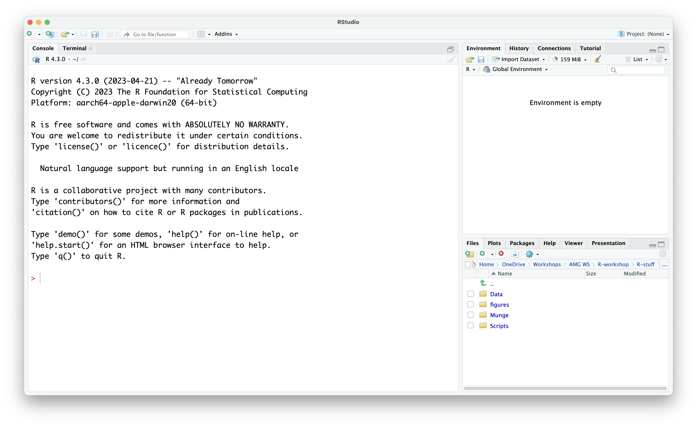
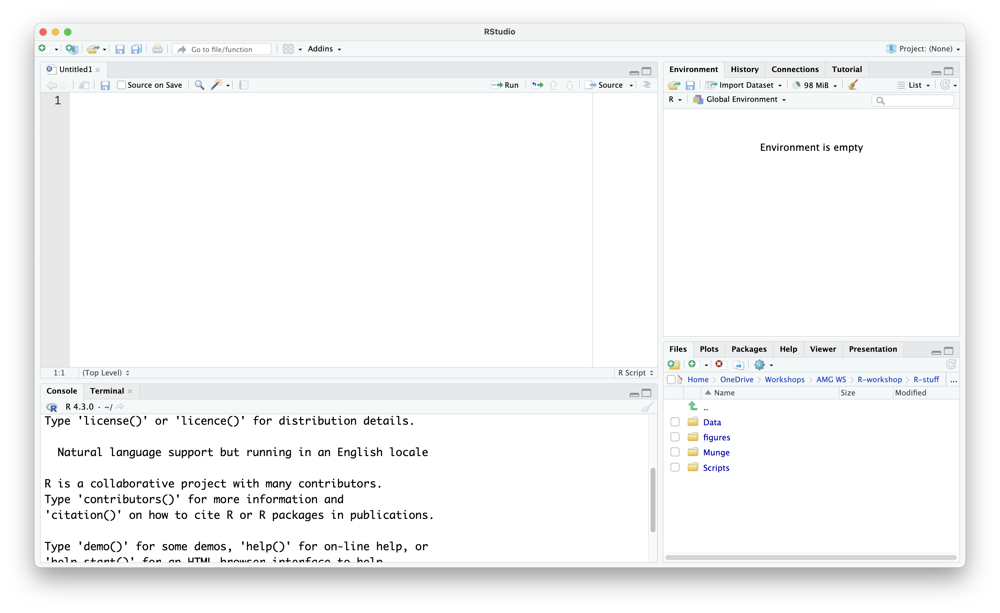

:::::::::::::::::::::::::::::::::::::: questions 

- How do I navigate the RStudio user interface?
- How do I run commands in the console?
- What is an R script and how do I create one?
- What are library packages?
- How do I get help?

::::::::::::::::::::::::::::::::::::::::::::::::

::::::::::::::::::::::::::::::::::::: objectives

- Navigate the user interface of RStudio
- Run commands in the console and in an R script
- Learn how to install and load a library package
- Look up documentation

::::::::::::::::::::::::::::::::::::::::::::::::

## The difference between RStudio and R

**RStudio** is an open-source programme and can be described as an Integrated Development Environment (IDE). One can view RStudio as a tool which helps make working with R more user-friendly. Some of the advantages of using RStudio include an autocompletion function, being able to write code in scripts and save them to be used later on, save objects/variables in the environment, visualise objects, and access to in-depth help documentation on R functions. On the other hand, **R** on its own comes with a basic interface which is essentially a command-line interface.

During this lesson, we will follow Alex in the exploration of R. We will use RStudio to write out R code, navigate different files on our computer, read data files, inspect objects we create, and visualise plots that we will produce.

## Getting around RStudio 

When you first open RStudio, you will be presented with the default layout of 3 main panes. 

{alt="Screenshot showing the RStudio interface with three main panes: the console on the left, the environment/history/connections tab in the top-right pane, and the plots/packages/help tab in the bottom-right pane. Menus and toolbars are located at the top."}

Default Layout: 

- **Console Pane** (left side of screen): This is the interface you would use if you were working in R rather than RStudio. The Console is used to type in and run commands, with the output being immediately displayed in the Console. A `>` symbol and a blinking cursor show you where to input the code. To run commands in the Console, you have to type in the command and press the `Return` key. Code typed directly in the console will not be saved, but you can view it in the History Pane (top right of screen - History tab is the one next to Environment). The Terminal tab next to the Console presents you with a command-line interface which you can use to access your computer's operating sysem. 
- **Environment Pane** (top right of screen): Any data files you read (or "import") into RStudio will show up here, together with any objects you create in the R environment.
- **Navigation Pane** (bottom right of screen): The Navigation Pane has multiple tabs.
  + **Files**: This tab allows you to view and navigate through the files you have in your current working directory as well as on your computer. New folders and files can be created and existing ones can also be deleted. Other options may be found by clicking on the gear icon.
  + **Plots**: Plots (e.g., bar graphs, scatter plots etc.) created during the R session will be shown in this window.
  + **Packages**: Library packages (explained later in this episode) currently installed are displayed. A ticked box next to a library package represents packages which are loaded in the environment. Library packages can also be installed and/or updated by the respective buttons. 
  + **Help**: Any package or function documentation looked up will be displayed in this tab.
  + **Viewer**: The Viewer tab displays web content generated through the session. 
  + **Presentation**: Any HTML slides generated during the session will be displayed in this tab.

*Note.* During this lesson we will not be generating any HTML content, therefore, we will not be using the Viewer and Presentation tabs. 

::::::::::: callout
### Customise your layout

The placement of these panes can be customised from the *Tools > Global Options > Pane Layout* menu. 
:::::::::::::

## Running commands in the Console vs in an R script

There are two main ways to run commands in RStudio. 

**Option 1**      
You can type your commands directly into the Console pane. After typing in your code, pressing the `Return` button on your keyboard will run the command, and R will show the result of your command below your code in the Console pane. This is a handy way to try out short lines of code. However, when the code typed in the Console pane will not be saved and will be lost once you close your RStudio session. 

**Option 2**     
You can write your code and save it in a file called an R script, which will allow you to access your code in subsequent RStudio sessions, by opening up your R script. This allows you to have a record of all your code, to be used later by yourself or others.

### Creating an R script

To create an R script, select *New File > R script* from the *File* menu at the top of the environment. Alternatively, you can click on the icon showing a white square overlaid by a white cross in a green circle and select *R script* from there. This action will create an empty R script, which will appear in the top left pane. This is now the R script editor, where you can type your code in the R script file. The RStudio layout has now changed to display 4 panes instead of the original 3.

{alt="Screenshot showing the RStudio interface with four main panes: the script editor in the top-left pane, the console in the bottom-left pane, the environment/history/connections tab in the top-right pane, and the plots/packages/help tab in the bottom-right pane. Menus and toolbars are located at the top."}

R scripts have `.R` as their file extension. Since typing up commands in an R script is similar to typing words in a text editor, pressing the `Return` key will not run your commands (like what happens in the Console pane), but it will create a new line for you to write more code. To run the code that you type in an R script, you have to tell RStudio to push your code from the R script to the Console. Once pushed to the Console, the code will be executed, and the results of the code will appear in the Console.

To run a line of code in your R script, make sure that your cursor is on the line of the script that you want to run, and then press the `Run` button at the top of the Editor pane. 

:::::::::::::::::: callout
### Shortcut to run R script code

Instead of pressing the `Run` button at the top of the Editor pane, you can either: 

- Press `Ctrl` + `Return` on Windows or Linux, or `Command` + `Return` on Mac
- Select the line or lines of code you want to run, and from the Code menu, select *Run selected line(s)*

:::::::::::::::::::

:::::::::::::::::: callout
### Don't forget to save your work

Make sure to save your R script by either pressing the floppy disk (a small light blue and white square) icon on the Editor pane, or by selecting *Save* from the File menu at the top. On your first save, you will be prompted to give your R script a name and select the location where you want to save your file.

The shortcut `Ctrl` + `s` on Windows and Linux, or `Command` + `s` can also be used to save your file. 

::::::::::::::::::::

## Library packages

Default R comes with what are called base functions. However, R users have also created other packages which hold different tools that can be added to R, to help extend R's capability, depending on what you want to use it for. Packages can be downloaded from the [Comprehensive R Archive Network](https://cran.r-project.org) known as CRAN.

One package that we will be using is the `dplyr` package, which allows us to subset and manipulate parts of a dataset, to have a closer look at certain elements - so let's download it. To do so, we first need to install it and then load it into our R environment by following these two steps: 

Step 1 - Install the package   


```r
install.packages('dplyr')
```

```{.output}
The following package(s) will be installed:
- dplyr [1.1.4]
These packages will be installed into "~/work/intro-to-R-for-MRs/intro-to-R-for-MRs/renv/profiles/lesson-requirements/renv/library/linux-ubuntu-jammy/R-4.4/x86_64-pc-linux-gnu".

# Installing packages --------------------------------------------------------
- Installing dplyr ...                          OK [linked from cache]
Successfully installed 1 package in 6.1 milliseconds.
```

Step 2 - Load package   


```r
library(dplyr)
```

```{.output}

Attaching package: 'dplyr'
```

```{.output}
The following objects are masked from 'package:stats':

    filter, lag
```

```{.output}
The following objects are masked from 'package:base':

    intersect, setdiff, setequal, union
```

:::::::::::::::::::::::::::::: challenge

### Exercise: Install and load packages

Further on, Alex will want to create plots for some data. For this, we need to install and load the `ggplot2` package. Complete the following code to first install the `ggplot2` package and then load the package in your R environment.

Step 1 - Install package

```
install.______('_____')
```

Step 2 - Load package

```
library(_____)
```

::::::::::::::: solution

Step 1 - Install package


```r
install.packages('ggplot2')
```

```{.output}
The following package(s) will be installed:
- ggplot2 [3.5.1]
These packages will be installed into "~/work/intro-to-R-for-MRs/intro-to-R-for-MRs/renv/profiles/lesson-requirements/renv/library/linux-ubuntu-jammy/R-4.4/x86_64-pc-linux-gnu".

# Installing packages --------------------------------------------------------
- Installing ggplot2 ...                        OK [linked from cache]
Successfully installed 1 package in 6.1 milliseconds.
```

Step 2 - Load package


```r
library(ggplot2)
```
:::::::::::::::
:::::::::::::::::::::::::::::::::

Let's have a look at our loaded packages. To view all packages loaded in our R environment, run the following command:


```r
(.packages())
```

```{.output}
[1] "ggplot2"   "dplyr"     "stats"     "graphics"  "grDevices" "utils"    
[7] "datasets"  "methods"   "base"     
```

## Getting help in R

R provides access to in-built documentation on any R function. To access this information, you can use the `help()` function, where you input the name of the function within the brackets of the aforementioned function. For example, if you want to look up the documentation on the `mean` function, which calculates the average of a calculation, you enter `help(mean)` in the terminal and press `Return`.


```r
help("mean")
```

The R documentation, which includes a brief description of the function, the arguments that can be inputted in the `mean` function, as well as some examples of how the function is used, will show up in the Help pane on the right-hand side of the RStudio environment. As a shortcut to the `help()` function, you can use the `?` help operator to look up the same documentation in this way:


```r
?mean
```

:::::::::::::::::::::: challenge
### Exercise: Getting help

Alex wants to look up the `mean` command, but instead of using `help()`, Alex used `help.search()`. However, this command outputted different search results.

- Run `help("mean")` in the console, and look at the results in the Help pane
- Do the same with the `help.search("mean")` command
- What is the difference? 

::::::::::::::: solution

Running the two commands consecutively:


```r
help("mean")
```


```r
help.search("mean")
```

The `help("mean")` command gave Alex the relevant help page for the `mean` function. On the other hand, the `help.search("mean")` function gave Alex a list of links to help pages, vignettes, and code demonstrations where the keyword `mean` was present.

::::::::::::::::
::::::::::::::::::::::::::::

The `help("mean")` command works well if you know the exact name of the function you want to look up. However, sometimes, one may be unsure of the exact name of a function. This is where the `help.search()` function comes in handy. This function will search through all R documentation, as well as installed packages and online resources for functions and packages which contain the keyword inputted, and will display the results in the Help pane as links to all functions and packages containing the keyword.

:::::::::::: callout
### A shortcut 

Instead of `help.search()`, you can also use its equivalent shortcut `??`


```r
??mean
```
::::::::::::::::

## Getting help outside of R 

There are numerous resources that offer helpful information on R. A non-exhaustive list includes: 

- [Stack Overflow](https://stackoverflow.com)
- [CRAN](https://cran.r-project.org/web/packages/available_packages_by_name.html)
- [R for Data Science](https://r4ds.hadley.nz/intro) by Wickham, Çetinkaya-Rundel, and Grolemund
- [Cheatsheets](https://posit.co/resources/cheatsheets/) of different R packages provided by posit (the website also contains cheatsheets of other programming languages e.g., Python)
- Other [The Carpentries](https://carpentries.org/index.html) lessons on R

:::::::::::: instructor

Testing out instructor notes 

:::::::::::::::::::::::

::::::::::::: keypoints

- Write your code in an R script to be able to save it
- Run code in an R script using `Command` + `Return` on Mac, `Ctrl` + `Return` on Windows/Linux, or by pressing the Run button
- Use `install.packages()` to download and install a library package
- Use `library()` to load the downloaded package in your environment
- Use `help()`, `help.search()` and the `?` and `??` help operators to look up documentation on commands and packages

:::::::::::::::::::::
