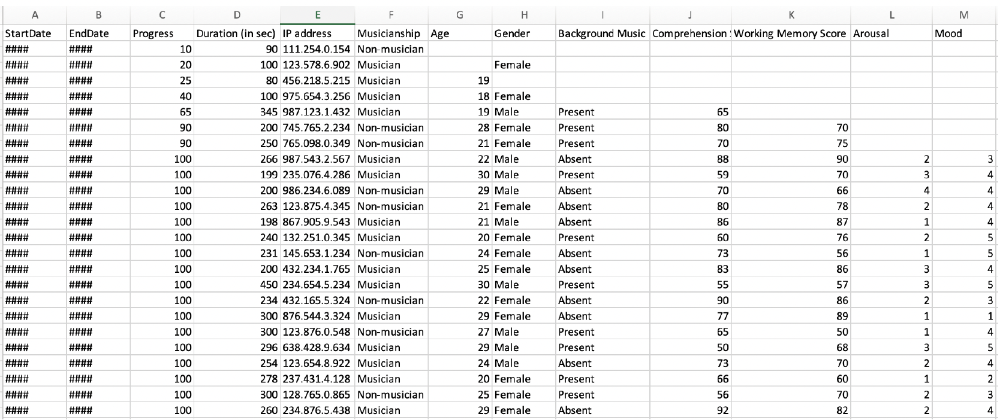
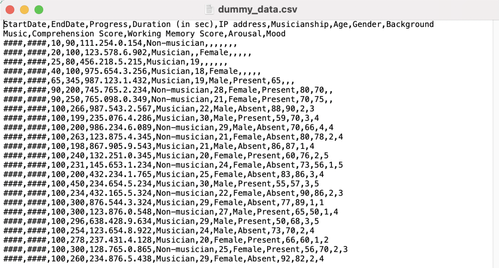

:::::::::::::::::::::::::::::::::::::: questions 
- How do I import csv and Excel data files in R?
- How are files in Excel and csv format displayed in R?
- How does R deal with missing values?
- How do I give names to the data set imported?
- How do I view the imported data?
::::::::::::::::::::::::::::::::::::::::::::::::

::::::::::::::::::::::::::::::::::::: objectives
- Import an Excel data file in R
- Import a csv data file in R
- Specify how to deal with missing values
- Create an object for your imported data
- Display the imported data in R
::::::::::::::::::::::::::::::::::::::::::::::::

## Introducing our dummy data set 
During this and the following episodes, we will be using a dummy data set as an example of survey data. The dummy data set is inspired by a study about the effect of background music on individuals’ working memory capacity carried out by [Lehmann and Suefert, 2017](https://www.frontiersin.org/journals/psychology/articles/10.3389/fpsyg.2017.01902/full). Our fake study consisted of  participants carrying out a comprehension task and a working memory task in one of the two conditions: in silence, or with background music. Participants also rated their mood and arousal on 5-point scales, and demographic information such as musicianship and age was collected. The fake study was run online, and data was collected using a Web-based survey tool. We will use R to explore the data set, and analyse the data, to see whether background music had an effect on our fake participants’ performances in the tasks.

But first, we need to download the files and import the data into R. 

Download the data files [here](https://drive.google.com/drive/folders/18bMh1zofsAdbwdsm7NwzsELXPBwYoUn9?usp=share_link). 

:::::::::::: callout
## Reminder: Files need to be in the working directory

Remember that R needs to know in which directory to look for files to be used and/or saved. The data files downloaded should be put in the directory set up in [Episode 4](https://acceleratingdigitalskills.github.io/intro-to-R-for-MRs/creating-directory-structure.html). 

- To check what your working directory is set to, use `getwd()`.  
- To set a new working directory, use `setwd("pathway here")`, or go into the desired folder through the Files Pane and click on the Cogwheel and select *Set as working directory*.  
::::::::::::::::::::

## Dummy data set formats
Our dummy data set files come in two formats: an Excel file and a csv file.

When opening our **dummy_data.xlxs** file in Excel, we are presented with the data in this manner: 



When opening our **dummy_data.csv** file using a text editor, our data looks something like this:



To test out how R handles both types of data files, we will first import the Excel file, and then the csv file in R. 

### Importing an Excel data file

An Excel file can be imported in R using the library package `readxl`. We need to install and load the library package by following the steps used in [Episode 3 of this lesson](https://acceleratingdigitalskills.github.io/intro-to-R-for-MRs/getting-started-with-R.html), before we can use it. 

::::::::::::::: challenge
## Exercise: The readxl package

Install and load the `readxl` package

:::::::::: solution 

Step 1: Install the package


```r
install.packages("readxl")
```

```{.output}
The following package(s) will be installed:
- readxl [1.4.3]
These packages will be installed into "~/work/intro-to-R-for-MRs/intro-to-R-for-MRs/renv/profiles/lesson-requirements/renv/library/R-4.3/x86_64-pc-linux-gnu".

# Installing packages --------------------------------------------------------
- Installing readxl ...                         OK [linked from cache]
Successfully installed 1 package in 5.5 milliseconds.
```

Step 2: Load the library package in your R environment


```r
library(readxl)
```

:::::::::::::
::::::::::::::::::::::::::
  
::::::::::::::: callout
## TIP
A quick way to check whether a library package was loaded in your environment or not, is to go to the Packages pane (bottom-right) and the Search function, look up the name of your library package. A tick should be displayed next to the library package name, indicating that the package is loaded.
:::::::::::::::::

We will now load our Excel data file into R, and assign our data file a name so that we can store it in our RStudio environment - in other words, saving our file in R's memory. To do so, we will use the **assign operator** which is **<-**. 

We will call our data file `exceldata`.

``` R
exceldata <- read_excel("dummy_data.xslx")
```

Once this command is run, an object with the name `exceldata` showing the number of observations and variables should be present in the Environment pane (top right). 

Let us now import our csv file into R. 

### Importing a csv data file

We will use the `read.csv()` function to import our csv file. Similarly, we will give our csv data file a name and 'save' it in our R environment. We will call this data file `csvdata`.

``` R
csvdata <- read.csv("dummy_data.csv")
```

This new object or variable can now be seen in our Environment pane.

:::::::::::::: instructor

A good place for a checkpoint, to make sure everyone is up to speed. 
Approx. time ~ 11 min up to here.

::::::::::::::::::


::::::::::::::: challenge
## Exercise: Representation of our two data files

Let's look at the contents of our `exceldata` in R using `View(exceldata)`. The contents of `exceldata` should open up in a new tab. 
Use the same function to view the contents of `csvdata`. 

Compare how the data files were represented in Excel and a text editor (images above) to how `exceldata` and `csvdata` are represented in R. Do you notice any differences or similarities?

Write down your answers in the Etherpad.
::::::::::::::::::::::


::::::::::::::::::: spoiler
## How R displayed our data

Data in Excel is presented in tabular format (the rows and columns) in cells. When we opened the .csv file outside of R, our data was not presented in a tabular format, but as a text file with data separated by commas (hence **c**omma **s**eperated **v**alues). However, R stored both data file formats as tabular data. 
::::::::::::::::::::::::::::

### Excel vs csv 

Although we could work with both Excel or csv files, in this lesson we will continue working with our data in csv format. 

csv files tend to be favoured as a data file format for a couple of reasons:

- csv is in plain text format and can be read with any text editor
- text editors cannot edit files saved in Excel format 
- csv files do not need any specific platform to open, whilst Excel files need specific applications
- csv files consume less memory than Excel files
- csv fils are generally faster than an Excel file 

Since we do not need the `exceldata` anymore, we will remove this from our R environment (i.e., we will remove this from R's memory) using `rm(exceldata)`. 

### Dealing with missing values 

More often than not, our data will contain some missing values, perhaps because certain participants did not complete the survey, or maybe there were some optional questions which participants opted to skip. 

One way to deal with missing values is at the data import stage. Most funtions in R tend to have several *arguments* (or settings) that you can specify.
One of the arguments of the `read.csv()` function that comes in handy in these cases is the `na.strings`.

The `na.strings` argument allows you to specify which values in your data set should be interpreted as NA values.

For example, for blank fields to be considered as missing values when importing a data file, we could write the following code:

``` R
ourdata <- read.csv("dummy_data.csv", na.strings = NA)
```

We can also specify any words (i.e., data of character type) that should be regarded as missing values, such as the words "NA" written down in a field:

```R
ourdata <- read.csv("dummy_data.csv", na.strings = "NA")
```

**Note.** Here we put NA in "" since in this case NA is written text. 

::::::::::::: challenge 
## Exercise: NAs in our data

Have a look at our `csvdata` and try to spot missing values in the data. Make a note of all representations of the missing data (e.g., blank fields, text such as "n/a" being used, etc.).  

Let's import our csv file once again in R, but this time adding the `na.strings` argument in the `read.csv()` function, specifying all values in the data that should be regarded as missing values. 

**HINT:** To combine multiple items in the `na.strings` argument, use the following syntax: `na.strings = c("A", "B, "C")`

View this new object. What can you observe?  

::::::: solution

In our data we have blank fields but also the use of the text "N/A" and "n/a" which should be regarded as missing values. 

To import our data file excluding all of the above, we write the following code: 

``` R
ourdata <- read.csv("dummy_data.csv", na.strings = c(NA, "N/A", "n/a"))
```

When we view `ourdata`, we can now see that any instances of written text with "N/A" and "n/a" are also being regarded as missing values. 

:::::::::::::
::::::::::::::::::::

::::::::::: callout
## GOOD TO KNOW

The `read_excel()` function has a similar argument called `na`:

``` R
exceldata <- read_excel("dummy_data.xlsx", na = "N/A")
```
::::::::::::::::

Now that we have our data file with the `na.strings` argument, we can remove the first `csvdata` created, and move on to inspecting our data in the next episode. 

:::::::::::: keypoints

- Use `read.csv()` to import a csv data file in R
- Use `read_excel()` from the `readxl` package to import an Excel data file in R
- Use the assign operator `<-` to give a name to your data set
- Specify how to deal with missing values using the `na.strings` argument in `read.csv()` when importing a csv file

:::::::::::::::::::::
